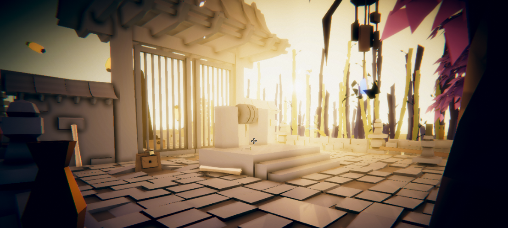
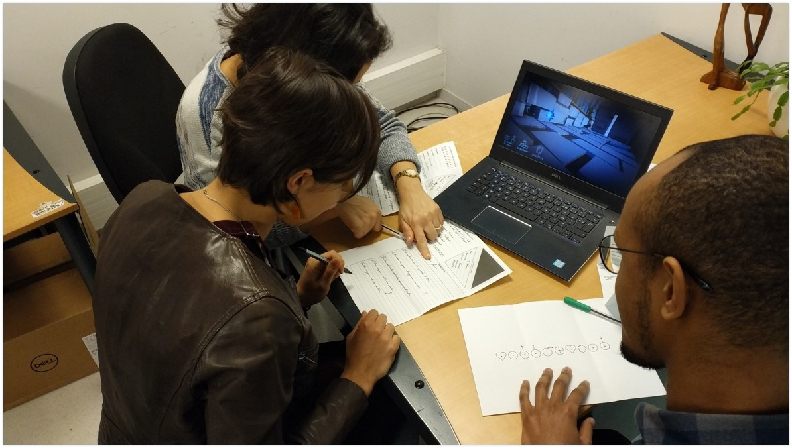
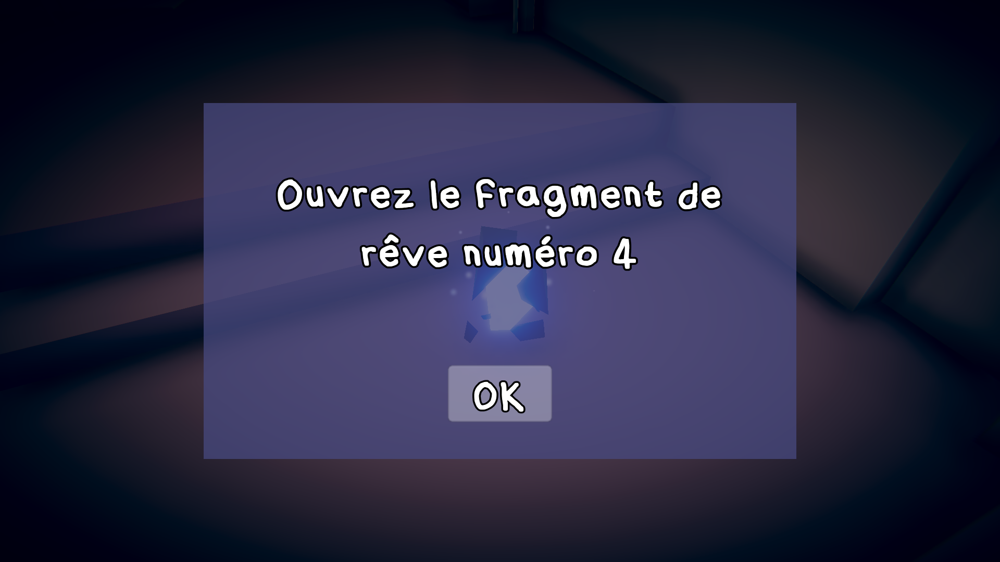
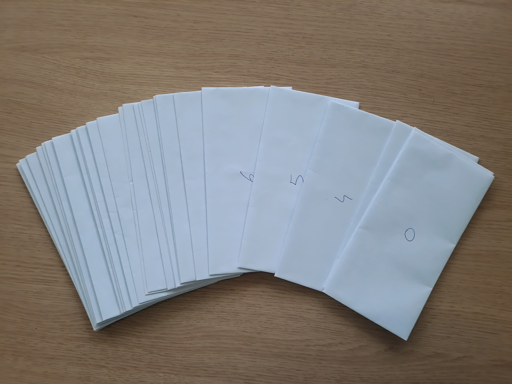

# Téléchargements
**Version 6.2** disponible depuis le 12/08/2021 (mise à jour le 31/08/2021)

1. [**Windows**](https://github.com/Mocahteam/E-LearningScape/releases/download/v6.2/E-LearningScape_Windows.zip)
2. [**MacOS**](https://github.com/Mocahteam/E-LearningScape/releases/download/v6.2/E-LearningScape_MacOS.zip)
3. [**Linux**](https://github.com/Mocahteam/E-LearningScape/releases/download/v6.2/E-LearningScape_Linux.zip)

Ce jeu étant développé avec des ressources limitées nous n'avons pas actuellement réalisé les procédures pour certifier le jeu sur les différents systèmes d'exploitation. Il est donc fort probable que votre ordinateur considère le jeu comme une menace et refuse de le lancer. Suivez donc les aides ci-dessous pour pouvoir lancer le jeu :

**Pour Windows :**
1. Votre antivirus peut bloquer le lancement du jeu, si une fenêtre apparaît, autorisez le lancement. Par exemple si vous obtenez le message "Windows a protégé votre ordinateur", cliquez sur le lien "Informations complémentaires" puis sur le bouton "Exécuter quand même".

**Pour MacOS :**
1. Dans le dossier **E-LearningScape** commencez par simplement **double cliquer** sur l'application **E-LearningScape**
2. Si votre Mac refuse de lancer le jeu :
   1. Tentez de faire un **clic-secondaire** (ou clic-droit) sur l'application et choisissez **Ouvrir**
   2. Dans la fenêtre vous devriez avoir maintenant un bouton **Ouvrir**, cliquez sur ce bouton
3. Si votre Mac refuse toujours de lancer le jeu :
   1. Toujours dans le dossier **E-LearningScape** faites un **clic-secondaire** (ou clic-droit) sur le fichier **PlayGame** et choisissez **Ouvrir**
   2. Dans la fenêtre vous devriez avoir maintenant un bouton **Ouvrir**, cliquez sur ce bouton
   3. Une fenêtre **Terminal** s'ouvre, si une demande d'autorisation d'accès aux fichiers s'affiche, acceptez la
   4. Dans la fenêtre **Terminal** entrez votre mot de passe quand il vous sera demandé afin d'autoriser le lancement du jeu. (Note : dans le terminal aucun symbole n'est affiché lorsque vous saisissez votre mot de passe, c'est tout à fait normal, saisissez simplement votre mot de passe à l'aveugle et validez)

# E-LearningScape
E-LearningScape est un jeu sérieux sous un format d'*escape game*. Les joueurs incarnent des marchands de sable naviguant dans le rêve d'une personne et devant l'aider à répondre à toutes les questions qu'elle se pose avant qu'elle ne se réveille. 

 

Vidéo de présentation : https://www.youtube.com/watch?v=K2mYKNe35Q4

# Principes de jeu
E-LearningScape peut se jouer selon deux modalités :
1. En solo, chaque joueur avançant à son rythme ;
2. En groupe de 2 à 4 joueurs autour d'un même ordinateur pour favoriser un travail collaboratif. Dans ce cas, le maître du jeu doit préparer quelques éléments avant la conduite de la session, il doit notamment imprimer un ensemble de documents et les placer dans des enveloppes (nous appelons ces éléments des fragments de rêves). Toutes les informations relatives à la constitution des enveloppes sont indiquées dans le fichier Lisez-moi.txt contenu dans l'archive relative à la version du jeu utilisée. Une fois les fragments de rêve préparés, les joueurs peuvent commencer leur partie. Une seule règle est à respecter : ouvrir les fragments de rêve (enveloppes) uniquement si le jeu vous y invite à le faire. 

 

# Informations techniques
E-LearningScape a été développé sous Unity avec la bibliothèque [FYFY](https://github.com/Mocahteam/FYFY).

# Comment créer mon propre jeu à partir d'E-LearningScape
E-LearningScape propose plusieurs mécaniques d'énigmes (relier trois points sur un tableau avec une corde, effacer les mots d'un tableau, révéler des images à l'aide d'une lampe UV...). Vous n'avez pas la possibilité de modifier ces mécaniques en revanche vous pouvez modifier les contenus qui apparaissent dans le jeu pour créer votre propre version d'E-LearningScape.

Pour changer les contenus dans le jeu il vous suffit de travailler sur les fichiers qui se trouvent dans le dossier **E-LearningScape_Data/StreamingAssets/[versionJeu]** pour Windows et Linux et dans le dossier **E-LearningScape.app/Contents/Resources/Data/StreamingAssets/[versionJeu]** pour MacOS :
- S'il s'agit d'éléments textuels modifiez le fichier **[...]/StreamingAssets/[versionJeu]/Data_LearningScape.txt**. Vous pourrez modifier le scénario de votre jeu, l'intitulé des questions, les réponses attendues, la description des objets ramassés...
- S'il s'agit d'éléments graphiques écrasez simplement les images présentes dans le dossier **[...]/StreamingAssets/[versionJeu]** avec vos nouveaux visuels pour qu'ils soient automatiquement chargés par le jeu.
- Le fichier **[...]/StreamingAssets/[versionJeu]/DreamFragmentLinks.txt** vous permet d'ajouter un lien hypertexte à chaque fragment de rêve.

# Crédits
**E-LearningScape Peda** a été réalisé par [Sorbonne Université](http://www.sorbonne-universite.fr/) à travers l’équipe [MOCAH](https://www.lip6.fr/recherche/team.php?acronyme=MOCAH) du LIP6, [CAPSULE](http://capsule.sorbonne-universite.fr/) et le projet Play@SU. C'est une adaptation numérique du jeu [LearningScape](https://sapiens-uspc.com/learningscape-2/) développé par la cellule [SAPIENS](https://sapiens-uspc.com/) de l'[USPC](http://www.sorbonne-paris-cite.fr/) et le [CRI](https://cri-paris.org/).

**E-LearningScape Access** est une version réalisé par l'[INSHEA](https://www.inshea.fr/).

**E-LearningScape Info** est une version réalisé par l’équipe [MOCAH](https://www.lip6.fr/recherche/team.php?acronyme=MOCAH) du LIP6.

# Données personnelles et traceurs
Il n'est pas collecté de données personnelles au téléchargement et à l'usage du jeu sérieux. Un identifiant aléatoire généré par le système est donné à chaque nouvelle session de jeu. Il est collecté des données sur les interactions du joueur avec le jeu. Elles sont collectées uniquement à des fins de recherche, d'enseignement et d'amélioration du jeu. Ces collectes se font lors des sessions de jeu (traceurs) ainsi que lors du questionnaire facultatif proposé en fin de session (logiciel LimeSurvey). La collecte des usages est anonyme et les résultats obtenus sont uniquement à destination des créateurs du jeu.
